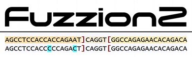
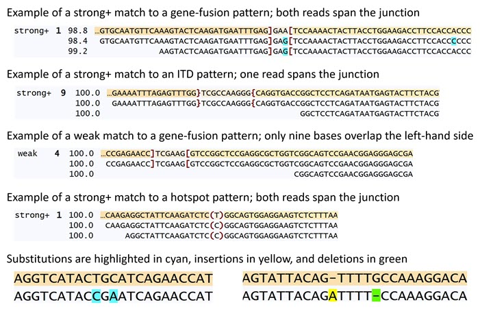

# 

# Overview

Fuzzion2 is a suite of computer programs developed at St. Jude Children's Research Hospital for finding DNA or RNA sequences that match patterns.  A pattern describes a targeted gene fusion, internal tandem duplication (ITD), or hotspot mutation, and can be any targeted sequence.  Fuzzion2 efficiently finds exact and fuzzy (inexact) matches of unmapped reads to patterns.  Fuzzion is short for <u>Fuzz</u>y Fus<u>ion</u> Finder and is pronounced FUZZ‑shin /ˈfɛʒən/.  Fuzzion2 supersedes the original [fuzzion](https://github.com/stjude/fuzzion) program.

There are seven programs in the Fuzzion2 suite:

1. *fuzzion2* is the program that finds DNA or RNA reads that match patterns.
2. *fuzzion2html* takes output from *fuzzion2* and generates an HTML file that can be viewed in a browser to see the matches.
3. *fuzzum* takes output from *fuzzion2* and produces a table showing the number of matches to each pattern or group of patterns.  It is used to summarize the results for a single sample.
4. *fuzzall* takes outputs from *fuzzum* and aggregates the counts for a set of samples.
5. *fuzzhop* examines Illumina-style read names in *fuzzion2* outputs and identifies possible instances of index hopping, i.e., reads that were misassigned to samples.
6. *fuzzort* sorts output from *fuzzion2*.  To compare *fuzzion2* output files using a difference program such as *diff*, sort each file using *fuzzort* and compare the sorted files.
7. *kmerank* can produce an alternate *k*‑mer rank file if needed.

#### License

The Fuzzion2 software is made available under the Apache License, Version 2.0.  You may not use this software except in compliance with this License.  A copy of this License is available at www.apache.org/licenses/LICENSE-2.0.

#### Reference

**[Fast and sensitive detection of targeted gene fusions using frequency minimizers and fuzzy pattern matching with Fuzzion2](https://www.cell.com/cell-reports-methods/fulltext/S2667-2375(25)00274-7)**
Stephen V. Rice, Michael N. Edmonson, Xiaolong Chen, Robert Greenhalgh, Michael Rusch, Liqing Tian, David A. Wheeler, Lu Wang, Patrick R. Blackburn, Maria Cardenas, Michael Macias, Andrew Thrasher, David Rosenfeld, Delaram Rahbarinia, Victor Pastor Loyola, Zonggao Shi, Scott Newman, Eric M. Davis, Jian Wang, Jennifer L. Neary, Mark R. Wilkinson, Xiaotu Ma, Xin Zhou, and Jinghui Zhang
*Cell Reports Methods*, Volume 5, Issue 12, 101238, December 15, 2025

------

# Build

The Fuzzion2 software was developed on Linux and contains more than 9,000 lines of C++ code.  It requires these external components:

* the [g++](https://gcc.gnu.org/) compiler, version 6 or later, for compiling the code;
* [HTSlib](https://github.com/samtools/htslib), version 1.10.2 or later, for reading BAM files; and
* [gunzip](https://www.gnu.org/software/gzip/), for decompressing gzipped FASTQ files.

The *fuzzion2* program requires also a *k*‑mer rank table.  Download the binary file named <code>fuzzion2_hg38_k15.krt</code> from [doi.org/10.5281/zenodo.6122447](https://doi.org/10.5281/zenodo.6122447).  It holds a 4‑GB 15‑mer rank table that was constructed from the GRCh38 human reference genome.  Use this file only when searching human DNA or RNA.  The *kmerank* program is provided to construct *k*‑mer rank tables for other species.

When given the 15‑mer rank table as input, *fuzzion2* must be run with at least 6 GB of RAM.

Here are the build steps:

```
# clone the repository
git clone https://github.com/stjude/fuzzion2.git

# set environment variables
HTSLIB=HTSlib-installation-directory # fill in directory
export CPATH=$CPATH:$HTSLIB/include
export LIBRARY_PATH=$LIBRARY_PATH:$HTSLIB/lib

# build the executable files and put them in build/bin
cd fuzzion2
make

# set this environment variable before running fuzzion2
export LD_LIBRARY_PATH=$LD_LIBRARY_PATH:$HTSLIB/lib
```

The <code>test</code> directory contains some files you can use to run a simple test:

```
fuzzion2 -pattern=example_patterns.txt -rank=fuzzion2_hg38_k15.krt \
   -fastq1=example_input1.fq -fastq2=example_input2.fq > my_output.txt

fuzzort < my_output.txt > my_sorted_output.txt

fuzzion2html -title="Fuzzion2 Example" < my_output.txt > my_output.html

fuzzum -id=example < my_output.txt > my_output_summary.txt
```

------

# Patterns

The *fuzzion2* program is given a pattern file as input.  This is a tab-delimited text file containing a heading line followed by one line for each defined pattern.  The first column, whose heading must be <code>pattern</code>, gives the name of the pattern; any name without blanks may be chosen.  The second column, whose heading must be <code>sequence</code>, gives the pattern's sequence, which is a string of A, C, G, and T bases and a few special characters that depend on the type of pattern as discussed below.  Pattern annotations, if any, are given in subsequent columns and may have any heading and content.  Thus, the pattern file format is:

```
pattern    sequence    annotationA    annotationB    ...
name1      sequence1   ...
name2      sequence2   ...
...        ...
```

#### Fusion Patterns

A fusion pattern represents the fusion of two sequences, a left- and right-hand side with an optional middle sequence.  The purpose of this type of pattern is to find reads that can be aligned to both sides and are therefore evidence of this fusion.  Brackets, intended for finding gene fusions, and braces for finding ITDs, delimit the sides.  The middle sequence specifies a string of zero or more bases, or is a single wildcard symbol (an asterisk) which matches any string of zero or more bases.  The ellipses <code>...</code> shown here are not part of the pattern sequence and would not be present in the pattern file; they are used here because the sequences are too long to fit on this page.

```
A gene-fusion pattern sequence is in this form: left]middle[right
...AGCTTAGGGCAACATATTATTAGAGAAATA]GAC[AAGCTTATAAATAATTCAGGATCGGATCCC...
...TCATGCGGGAACGGATACGAACCCGAAATG][GATATTACCAACATAATCACACCAAGGAGT...
...GGGAATTAGATAGCCATCCCCATAACACAA]*[TATTAGACGATAATACGATACGAGCTAAAG...

An ITD pattern sequence uses braces instead of brackets: left}middle{right
...TATTAGATAGCCGATTAGCAATAACGTTTA}ATTGA{GCAATAAGGGGAATCAACGATTAACTAGAT...
...CAACACTATACCACTAAGTTTAAACACACC}{GATAAGAGCCCATTACACATTTAGGACACA...
...GGAAATCACCAGTGTACGATATGGCACTAA}*{TTAAGACCCATAACTGGAAGAGGAAGCTCA...
```

#### Hotspot Patterns

A hotspot pattern defines a two-sided pattern sequence for finding reads that harbor a hotspot mutation such as a single nucleotide variant (SNV).  A read matches this pattern if it can be aligned to the left- and right-hand sides without matching any of the middle sequences in parentheses.  Each middle sequence is a string of one or more bases.  If there is more than one middle sequence, they are separated by vertical bars as shown in the examples below.  These middle sequences typically represent wild-type alleles, and matches are reported when reads differ from them.

```
A hotspot pattern sequence is in this form: left(exclude)right
...AAGATCTCAAGAGGATTAGGAATAGGACAG(C)TACAGGGGGGACTACAACAGGATGATGGTT...
...TGATACCAAATGGATCCGATTCTCTAGGAT(A|G)GACTCTTATTAGGGAGTTATAAATATTTTT...
...CGAGACAAATTGAGAACCCATTATAGAACG(T|TC|TTA)AACCACCATTATGGGAATAGGATAGGATTA...
```

#### Simple Patterns

Lastly, any sequence can be specified without special characters to find reads that can be aligned to it.  For example:

```
ACCAGAGTTAGAGGGATTAGGCCCATTAGGAAACCGTGGGATTATTTAGCGGATTAGGGCAACAT
```

A pattern file may contain any combination of pattern types.  For all pattern types, it is recommended that the pattern sequence be 100 to 1000 bases in length.

#### Available Pattern Files

There are pattern files freely available for use with Fuzzion2.  These files contain thousands of patterns for detecting gene fusions and ITDs that occur primarily in pediatric cancers.  These patterns were collected and curated by St. Jude Children's Research Hospital as part of a multi-year project; see the reference cited above for information about this project.  You will find these pattern files in the <code>patterns</code> directory of this repository:

- <code>St_Jude_RNA_patterns_2024-10-11a.txt</code>, set of 21,736 patterns that was used with Fuzzion2 v1.4.0 for the tests described in the reference cited above;
- <code>St_Jude_RNA_patterns_2025-10-08.txt</code>, set of 22,710 patterns, recommended for most users;
- <code>St_Jude_RNA_patterns_2026-01-20.txt</code>, expanded set of 23,166 patterns.

For code to construct patterns, see the companion repository, [fuzzion2_patgen](https://github.com/stjude/fuzzion2_patgen/).

------

# Finding Matches

The names of the pattern file and *k*‑mer rank table file are given to *fuzzion2* using the required <code>‑pattern</code> and <code>‑rank</code> options.  Matches of reads to patterns are written to the standard output stream as a tab-delimited text file.

```
Usage: fuzzion2 OPTION ... [filename ...] > hits

These options are required:
  -pattern=filename   name of pattern input file
  -rank=filename      name of binary  input file containing the k-mer rank table

Specify -fastq1 and -fastq2, or -ifastq or -ubam,
or list the names of FASTQ and Bam files on the command line
  -fastq1=filename    name of FASTQ Read 1 input file
  -fastq2=filename    name of FASTQ Read 2 input file
  -ifastq=filename    name of interleaved FASTQ input file (may be /dev/stdin)
  -ubam=filename      name of unaligned Bam input file

The following are optional:
   N is a numeric value, e.g., -threads=4
  -maxins=N     maximum insert size in bases. . . . . . . . . . . . default 600
  -maxrank=N    maximum rank percentile of minimizers . . . . . . . default 99.9
  -maxtrim=N    maximum bases second read aligned ahead of first. . default 5
  -minbases=N   minimum percentile of matching bases. . . . . . . . default 90.0
  -minov=N      minimum overlap in number of bases. . . . . . . . . default 7
  -show=N       show best only (1) or all patterns (0) that match . default 1
  -single=N     show single-read (1) or read-pair (0) matches . . . default 0
  -threads=N    number of threads . . . . . . . . . . . . . . . . . default 8
  -w=N          window length in number of bases. . . . . . . . . . default 10
```

Short and long reads are supported.  The reads come from FASTQ or Bam files named on the command line.  If reads are paired, they may belong to a pair of FASTQ files named by the <code>‑fastq1</code> and <code>‑fastq2</code> options (Read 1 and Read 2 in separate files); or one interleaved FASTQ file named by the <code>‑ifastq</code> option or one unaligned Bam file named by the <code>‑ubam</code> option (in which Read 1 and Read 2 are consecutive).  Alternatively, the names of files containing paired or unpaired reads may be listed on the command line.  If <code>‑single=1</code>, then aligned Bam files are also permitted.  Each gzipped FASTQ file (with a name ending in <code>.gz</code>) will be decompressed by *fuzzion2* using [gunzip](https://www.gnu.org/software/gzip/).

By default, <code>‑single=0</code>, and *fuzzion2* attempts to match read pairs to the patterns in the pattern file and reports an error if unpaired reads are encountered in the input.  Both reads of a read pair must be aligned to a pattern sequence for a match to be reported.

If <code>‑single=1</code>, *fuzzion2* attempts to match each individual read to the patterns in the pattern file.  This setting is required for processing unpaired reads such as long reads.  Also, this setting is recommended for processing paired reads when using short pattern sequences, because it may not be possible to align both reads of a read pair to a short pattern sequence.

It is possible for a read or read pair to match multiple patterns in the pattern file.  By default, <code>‑show=1</code>, and *fuzzion2* reports only the best match.  Setting <code>‑show=0</code> causes *fuzzion2* to report all matching patterns.

The other *fuzzion2* options are described here:

* For a match to be reported, the alignment must have at least seven bases of overlap (<code>‑minov=7</code>) of the read or read pair with each side of the pattern.
* The default setting, <code>‑minbases=90.0</code>, means that at least 90% agreement of bases is needed for an alignment to be considered a match.  If only exact matches are desired, set this option to 100.0.
* The <code>‑maxins</code> option specifies the maximum allowed insert size of an alignment of a read pair to a pattern sequence.  Normally, Read 1 precedes Read 2 in an alignment.  The <code>‑maxtrim</code> option specifies the maximum number of bases that Read 2 can precede Read 1 in an alignment; it defaults to 5 bases to tolerate imprecise adapter trimming.
* The default setting, <code>‑maxrank=99.9</code>, means that the 0.1% most common *k*‑mers in the reference genome will be ignored for efficiency.  If pattern sequences consist of very common *k*‑mers, the value of this option may be increased to detect them.  This option may be set as high as 100.0 so that no *k*‑mers are ignored, but the program may run slowly.
* If pattern sequences are short, it may be helpful to reduce the window length using the <code>‑w</code> option.
* The *fuzzion2* program is multithreaded, and the number of threads is given by the <code>‑threads</code> option.

------

# Visualizing Matches

The *fuzzion2html* program accepts a *fuzzion2* output file from the standard input stream and writes a HTML file to the standard output stream.  This HTML file can be opened in any browser (such as Google Chrome or Microsoft Edge) to view the matches found by *fuzzion2*.  SNPs, indels, and sequencing errors are highlighted in the display.  An example can be seen [here](https://htmlpreview.github.io/?https://github.com/stjude/fuzzion2/blob/master/test/SJBALL020765_D1_by_pattern.html).

```
Usage: fuzzion2html OPTION ... < fuzzion2_hits > html

The following are optional:
  -group=string   comma-separated list of column headings, default is no grouping
  -strong=N       minimum overlap of a strong match in #bases, default is 15
  -title=string   string to include in the title of the HTML page
```

Each match is designated as <code>strong+</code>, <code>strong‑</code>, or <code>weak</code>, or is marked as <code>dup</code> to indicate that it is a duplicate (i.e., has the same read sequence) of a preceding match in the display.  A match is regarded as weak if the overlap on one side of the pattern is fewer than 15 bases (the setting of the <code>‑strong</code> option).  Otherwise, it is a strong match categorized as follows: If at least one read of the read pair spans the junction, i.e., the read overlaps both sides of the pattern, then it is a <code>strong+</code> match.  If neither read of the read pair spans the junction, it is a <code>strong‑</code> match.  When the sides of the pattern are delimited by braces instead of brackets, <code>strong‑</code> matches are unreported.  Braces are used to require at least one read to span the junction.

There are three lines in the display of a read pair that has been matched to a pattern.  The first line shows the pattern sequence and the second and third lines show the read pair aligned to the pattern sequence.  In the first example below, the scores on the left indicate that the first read has been aligned to the pattern sequence with 98.4% agreement of bases; the second read has been aligned with 99.2% agreement; and overall, the read pair has been aligned with 98.8% agreement.  Disagreements, in this case substitutions, are highlighted.  The examples below have been truncated on the right to fit this page.



------

# Counting Matches

The *fuzzum* program accepts a *fuzzion2* output file from the standard input stream and writes a summary of matches to the standard output stream as a tab-delimited text file.  For each pattern with at least one match, a line indicates the total number of matches to that pattern and the number of distinct matches, excluding duplicates.  The number of distinct matches is broken down by category: <code>weak</code>, <code>strong‑</code>, and <code>strong+</code>.

While *fuzzum* is intended to summarize the matches found in one sample, *fuzzall* aggregates the counts for a set of samples.  Two or more *fuzzum* output files are named on the *fuzzall* command line, and an aggregate summary is written to the standard output stream as a tab-delimited text file.  For each pattern with at least one match, a line summarizes the matches found in the set of samples.  The "ID list" gives the name of each sample that has a match, and each sample ID is followed by two numbers in parentheses, e.g., (24/22), indicating the number of distinct matches (24) and the number of these that are strong matches (22).

```
Usage: fuzzum OPTION ... < fuzzion2_hits > hit_summary

This option is required:
  -id=string      identifies the sample

The following are optional:
  -group=string   comma-separated list of column headings, default is no grouping
  -strong=N       minimum overlap of a strong match in #bases, default is 15

Usage: fuzzall OPTION fuzzum_filename ... > pattern_summary

The following is optional:
  -dataset=name   name associated with this dataset
```

Rather than summarize by pattern, it is possible to define groups of patterns and summarize by group.  The <code>‑group</code> option specifies a comma-separated list of annotation column headings in the pattern file.  The first heading in this list is the grouping column; patterns that have the same value in this column are grouped together.  Additional headings, if any, identify group annotation columns.  For example, the pattern files in the <code>patterns</code> directory have an annotation column heading, <code>gene_pair</code>.  Specify <code>‑group=gene_pair</code> to group the patterns by gene pair.

------

# Detecting Index Hops

When two or more samples are sequenced together in the same flowcell, it is possible that a read pair from one sample is misassigned to another of these samples.  This is known as index hopping.  If *fuzzion2* matches that read pair to a pattern, it will appear that the wrong sample has the fusion or hotspot mutation represented by that pattern.  Each Illumina read name identifies the sequencing instrument, run number, flowcell and lane, separated by colons, as in <code>K00309:78:HHLVFBBXX:7</code>.  If reads have Illumina read names, then the *fuzzhop* program can detect possible instances of index hopping.  

Two or more *fuzzion2* output files are named on the *fuzzhop* command line, and possible index hops are written to the standard output stream as a tab-delimited text file.  By default, <code>‑bylane=1</code>, and strong matches from the same flowcell lane are grouped together in the output.  Set <code>‑bylane=0</code> to group by flowcell rather than by flowcell lane.

```
Usage: fuzzhop OPTION ... fuzzion2_filename1 fuzzion2_filename2 ... > possible_index_hops

The following are optional:
  -bylane=N   group by flowcell lane (1) or by flowcell (0), default is 1
  -strong=N   minimum overlap of a strong match in #bases,   default is 15
```

In the following example output from *fuzzhop*, we see that the *fuzzion2* output file named <code>SJST030389_D1.txt</code> contains many strong matches of the pattern named <code>BCOR-CCNB3-08</code>: 1,573 of these matches originated from flowcell lane <code>K00309:78:HHLVFBBXX:7</code> and 1,620 came from other flowcell lanes.  By contrast, the file named <code>SJBT030392_D1.txt</code> has only one strong match of this pattern.  We can reasonably conclude that this match is due to index hopping, i.e., the read pair matched to this pattern was assigned to the wrong sample in the sequencing process.  Likewise, we see many strong matches of pattern <code>HOXA10-HOXA9-CDK6-01</code> in <code>SJTALL032261_D1.txt</code>, with a few that were likely misassigned to two other samples.  Although we say "likely," it is possible that these samples have a lowly expressed fusion.

```
                                             strong hits  strong hits
fuzzhop v2.0.0        flowcell lane             here      elsewhere   file name
BCOR-CCNB3-08         K00309:78:HHLVFBBXX:7        1           0      SJBT030392_D1.txt
BCOR-CCNB3-08         K00309:78:HHLVFBBXX:7     1573        1620      SJST030389_D1.txt

HOXA10-HOXA9-CDK6-01  A00908:71:HLGTLDRXX:1        1           0      SJST032256_D1.txt
HOXA10-HOXA9-CDK6-01  A00908:71:HLGTLDRXX:1        2           0      SJST032259_D1.txt
HOXA10-HOXA9-CDK6-01  A00908:71:HLGTLDRXX:1      352           0      SJTALL032261_D1.txt
```

------

# Copyright

Copyright 2026 St. Jude Children's Research Hospital
